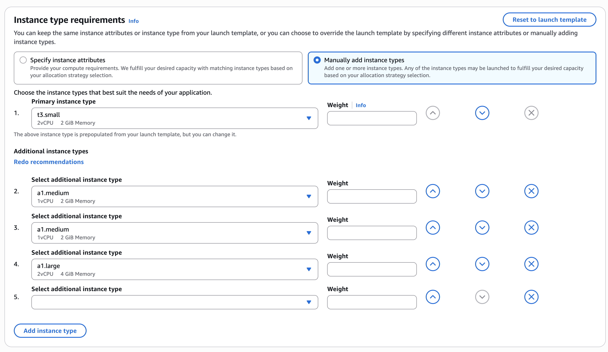
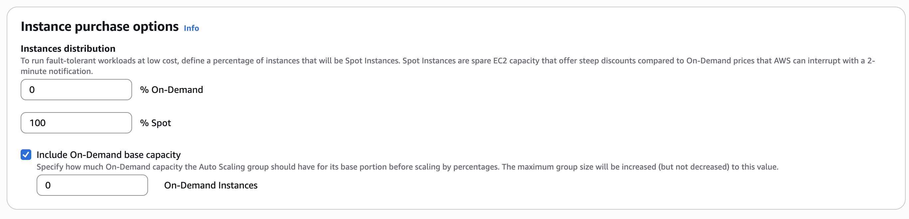
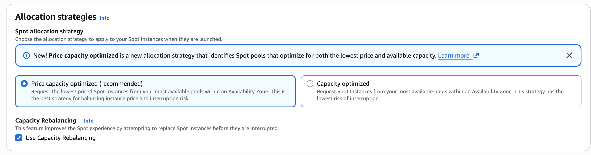

# 💸 Cost Optimization (Spot Instances)

To make the infrastructure highly cost-effective without sacrificing reliability, the Auto Scaling Group was reconfigured to utilize **AWS Spot Instances**. Spot instances leverage spare AWS compute capacity, offering steep discounts (up to 90%) compared to standard On-Demand pricing. 

Because our ASG automatically handles instance replacements, capacity rebalancing, and the ALB safely routes traffic, we can safely use Spot instances with **zero downtime**, reducing our overall compute bill by ~70%.

---

### 🛠️ Step 1: Modifying ASG Purchase Options

We updated the existing Auto Scaling Group to shift entirely from On-Demand instances to Spot instances while configuring intelligent allocation strategies to handle interruptions.

* ⚙️ **Action:** Edited the `App-ASG` configuration to manually add instance types and override the launch template.

| ⚙️ Configuration | 📌 Value | 📝 Description |
| :--- | :--- | :--- |
| **Instance Types** | 🖥️ `t3.small` (Primary) `a1.medium`, `a1.large` (Additional) | Manually added multiple instance types to ensure high availability. If one type runs out of Spot capacity, the ASG falls back to the others. |
| **On-Demand Base** | 🔢 `0` | Ensured no expensive baseline instances are required. |
| **On-Demand % Above Base** | 📉 `0%` | Forces the ASG to use **100% Spot Instances** for all scaling activities. |
| **Allocation Strategy** | 🎯 `Price capacity optimized` | Instructs AWS to provision instances from the deepest, cheapest spare capacity pools to balance price and interruption risk. |
| **Capacity Rebalancing** | ✅ `Enabled` | Allows the ASG to proactively launch a replacement instance *before* an active Spot instance is interrupted (based on AWS risk signals), ensuring a graceful handoff and zero downtime. |

#### Instance Type Requirements

#### Instance Purchase Options

#### Allocation Strategies & Capacity Rebalancing

---

### 🔄 Step 2: Executing an Instance Refresh 

To apply the new Spot pricing model to the currently running (expensive) instances without taking the application offline, we triggered an automated rolling update.

* ⚙️ **Action:** Navigated to the **Instance refresh** tab within the ASG and initiated a refresh.

> 🟢 **Minimum Healthy Percentage:** Set strictly to `50%`. This ensures the system gracefully deletes the old On-Demand instances one by one *only after* spinning up the new Spot instances, maintaining continuous availability.

---